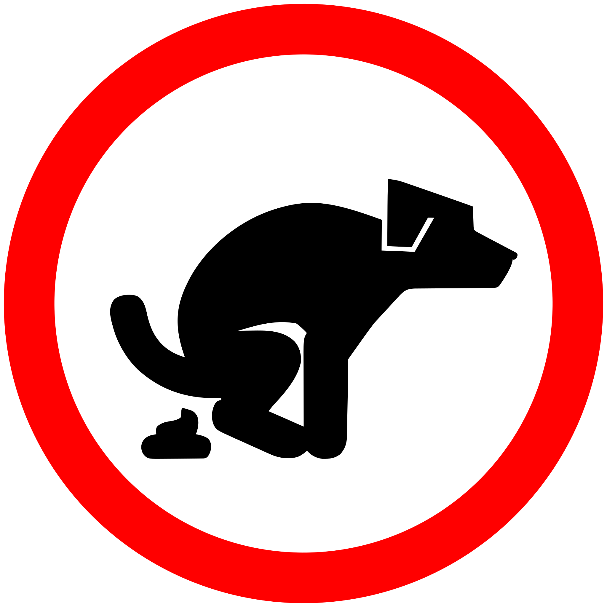
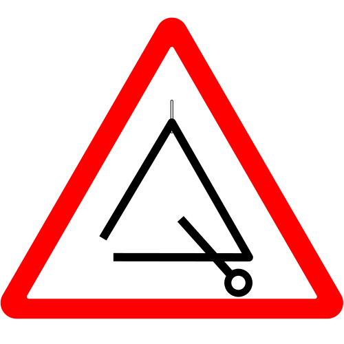
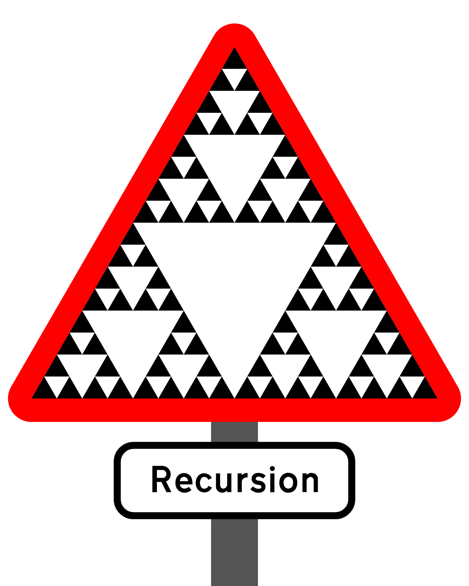
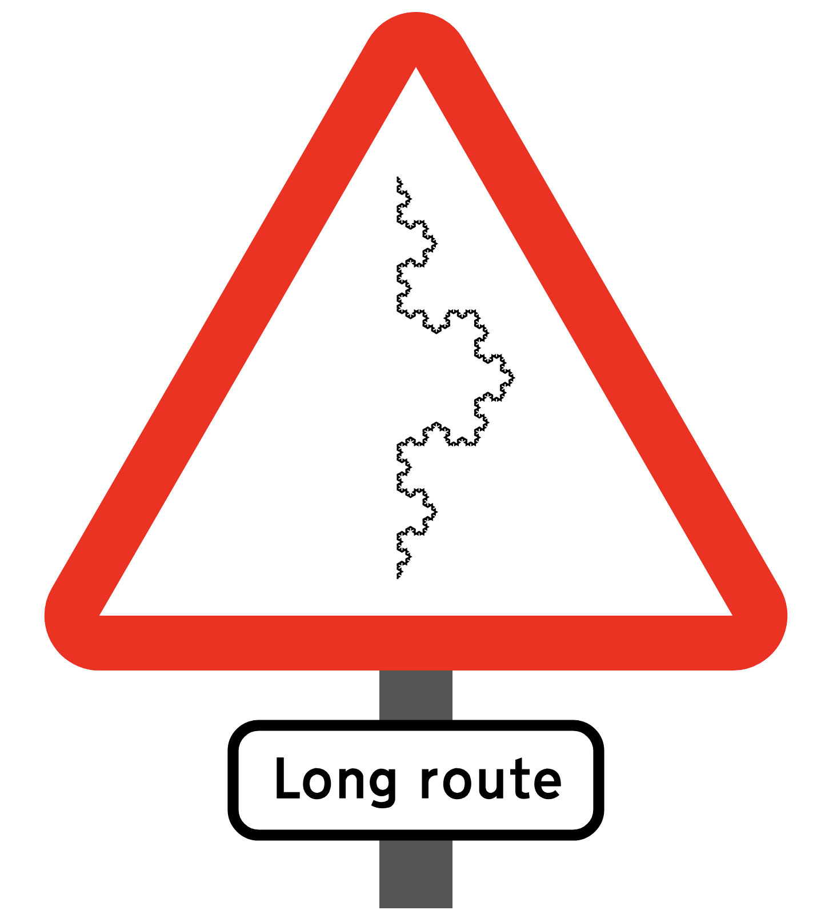

# No, dog!

A selection of silly road signs inspired by the "dog poo, no thank you" signs,
which seem to be quite common in my city.

What else are dogs forbidden from doing?

## No juggling

## No playing the trumpet

## No entering portals

## Other signs

### Warning: triangle

## Warning: recursion

## Warning: long route

